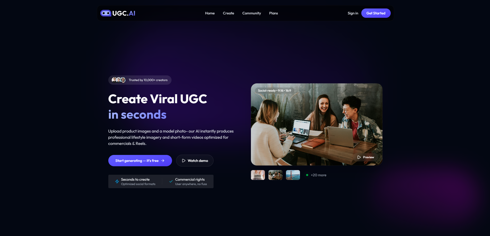
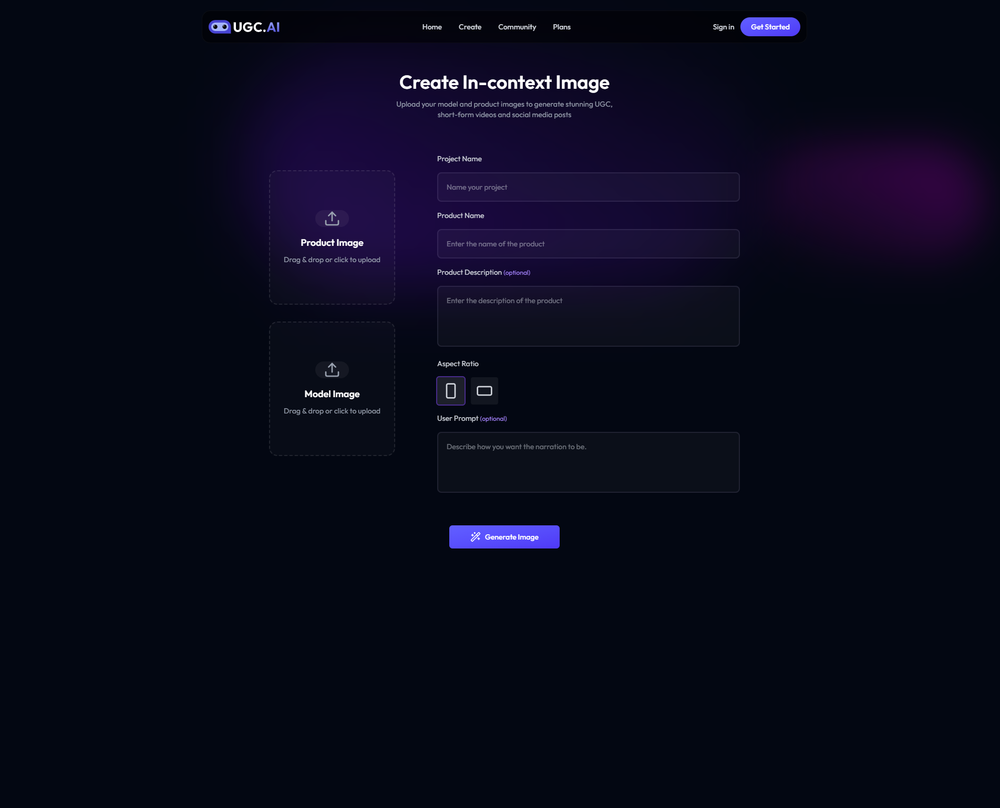
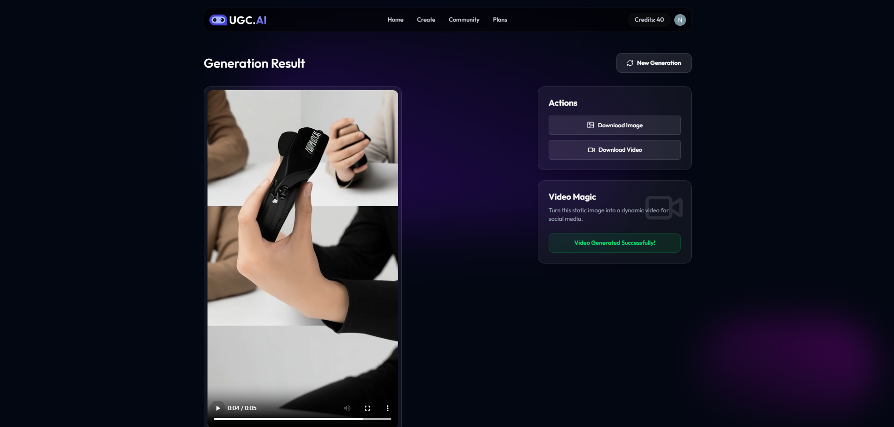
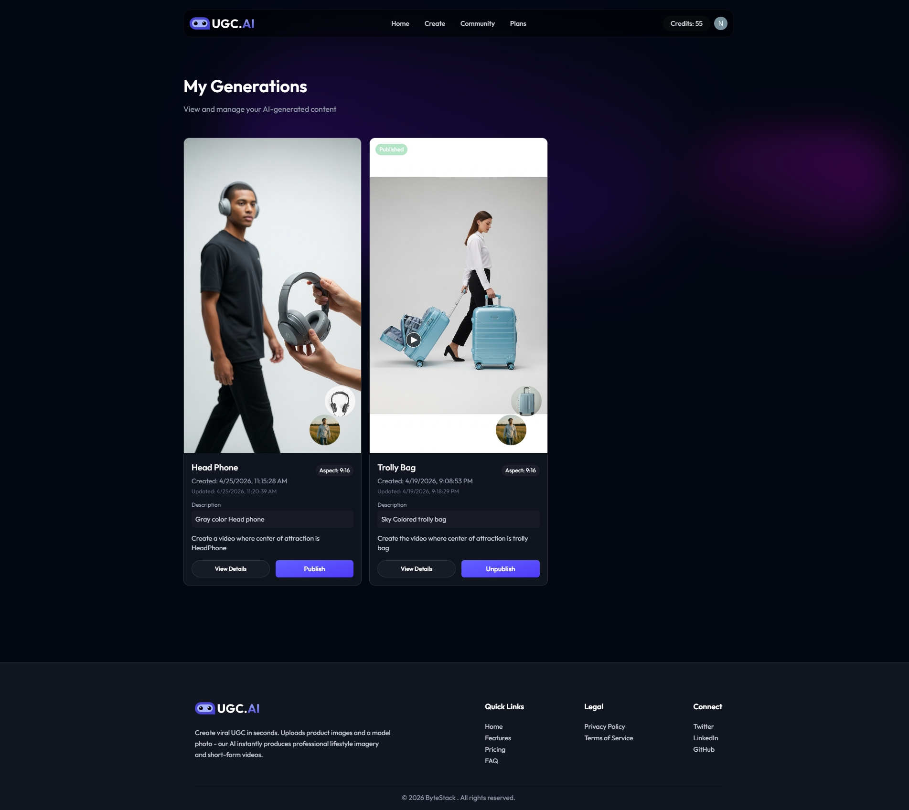
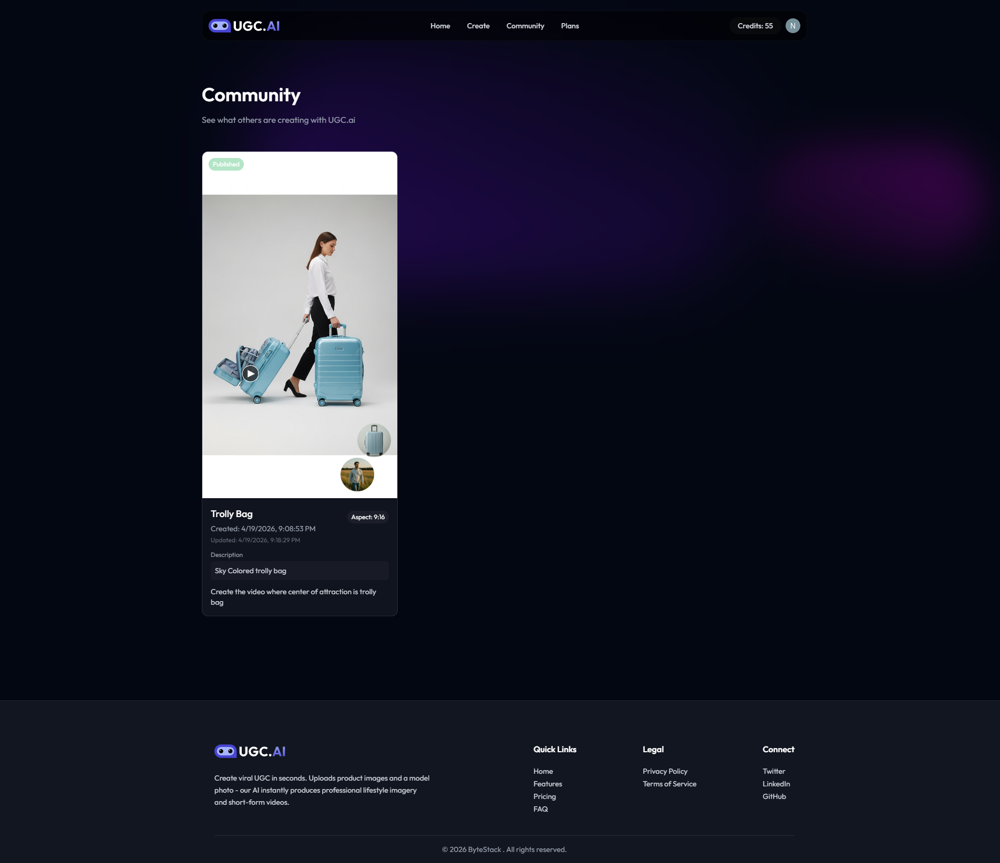

<div align="center">

  <h1>🎬 UGC AI Studio — AI-Powered Short Video Generator</h1>
  
  <p>A full-stack AI-powered platform that transforms product images into engaging UGC-style short videos with AI narration — built with React, Node.js, Google Gemini, Replicate, and Prisma.</p>

  <p>
    <a href="https://ugc-project-tau.vercel.app/"></a>
    <a href="https://github.com/NusratAdor/ugc-ai-studio"></a>
    <a href="#"></a>
  </p>

</div>

---

## 🌐 Live Demo

🔗 **[https://ugc-project-tau.vercel.app/](https://ugc-project-tau.vercel.app/)**

---

## ✨ Features

- **AI Video Generation** — Upload product images and generate short-form UGC-style videos using Google Gemini + Replicate AI models
- **Authentication via Clerk** — Secure sign-in/sign-up with webhook-based user sync to PostgreSQL
- **Credit System** — New users receive 20 free credits; each video generation consumes credits
- **Project Management** — Create, view, update, and delete video generation projects
- **Community Feed** — Browse and discover videos created by other users on the platform
- **Subscription Plans** — Multiple pricing tiers with different credit allocations
- **Cloud Media Storage** — Generated videos and uploaded images stored via Cloudinary
- **Error Monitoring** — Production error tracking with Sentry
- **Responsive Design** — Modern mobile-first UI with smooth Framer Motion animations

---

## 🔌 Backend & API Features

- RESTful API architecture with Express.js
- Clerk authentication middleware on protected routes
- Webhook verification for user sync
- Multer-based file upload handling
- Prisma ORM for type-safe database queries
- Sentry integration for real-time error monitoring
- Modular controller-based backend structure

---

## 💡 Why I Built This

I built AI UGC Studio to explore how modern AI APIs (Gemini + Replicate) can be integrated into a full-stack product workflow — combining image understanding, video generation, credit-based billing, and cloud media storage in a real production-grade application.

---

## 🛠️ Tech Stack

### Frontend
| Technology | Purpose |
|---|---|
| React 19 | UI framework |
| TypeScript | Type safety |
| Vite | Build tool & dev server |
| Tailwind CSS | Styling |
| Framer Motion | Animations |
| React Router DOM | Client-side routing |
| Clerk (React SDK) | Authentication & user management |
| Axios | HTTP client |
| Lenis | Smooth scrolling |
| Lucide React | Icons |
| React Hot Toast | Toast notifications |

### Backend
| Technology | Purpose |
|---|---|
| Node.js + Express | REST API server |
| TypeScript | Type safety |
| Prisma ORM | Database queries and schema management |
| PostgreSQL | Relational database |
| Clerk (Node SDK) | Webhook verification and auth middleware |
| Google Gemini | AI script/narration generation |
| Replicate | AI video generation model |
| Cloudinary | Media storage for images and videos |
| Multer | File upload handling |
| Sentry | Error monitoring and alerting |

### Infrastructure
| Technology | Purpose |
|---|---|
| Vercel | Deployment (frontend + backend) |
| PostgreSQL (Neon) | Serverless database hosting |
| Clerk | Identity and user management |
| Cloudinary | Cloud media delivery |

---

## 📸 Screenshots

### Homepage


### Project Creation


### Result


### My Generations


### Community Feed


---

## ⚙️ Getting Started

### Prerequisites

- Node.js 18+
- A [Clerk](https://clerk.com) account — for authentication and user sync
- A [Neon](https://neon.tech) or local PostgreSQL database
- A [Google AI Studio](https://aistudio.google.com) account — for Gemini API
- A [Replicate](https://replicate.com) account — for video generation
- A [Cloudinary](https://cloudinary.com) account — for media storage
- A [Sentry](https://sentry.io) account — for error monitoring (optional)

### 1. Clone the repository

```bash
git clone https://github.com/NusratAdor/ugc-ai-studio.git
cd ai-ugc-studio
```

### 2. Install dependencies

```bash
# Install server dependencies
cd server && npm install

# Install client dependencies
cd ../client && npm install
```

### 3. Set up environment variables

Create a `.env` file inside the `server/` directory (see `.env.example` for reference):

```env
# Server
PORT=5000
NODE_ENV=development

# Database
DATABASE_URL=your_postgresql_connection_string

# Clerk
CLERK_PUBLISHABLE_KEY=your_clerk_publishable_key
CLERK_SECRET_KEY=your_clerk_secret_key
CLERK_WEBHOOK_SECRET=your_clerk_webhook_secret

# Google Gemini AI
GEMINI_API_KEY=your_gemini_api_key

# Replicate
REPLICATE_API_TOKEN=your_replicate_api_token

# Cloudinary
CLOUDINARY_CLOUD_NAME=your_cloud_name
CLOUDINARY_API_KEY=your_cloudinary_api_key
CLOUDINARY_API_SECRET=your_cloudinary_api_secret

# Sentry
SENTRY_DSN=your_sentry_dsn
```

Create a `.env` file inside the `client/` directory:

```env
VITE_CLERK_PUBLISHABLE_KEY=your_clerk_publishable_key
VITE_API_BASE_URL=http://localhost:5000
```

### 4. Set up the database

```bash
cd server
npx prisma migrate dev
npx prisma generate
```

### 5. Run the development servers

```bash
# In one terminal — start backend
cd server && npm run dev

# In another terminal — start frontend
cd client && npm run dev
```

Frontend runs at `http://localhost:5173` — Backend runs at `http://localhost:5000`

---

## 📁 Project Structure

```
ai-ugc-studio/
├── client/                     # React frontend
│   ├── src/
│   │   ├── assets/             # Static assets & dummy data
│   │   ├── components/         # Reusable UI components
│   │   ├── configs/            # Axios configuration
│   │   ├── pages/              # Route-level page components
│   │   ├── types/              # TypeScript type definitions
│   │   ├── App.tsx             # Root app component
│   │   └── main.tsx            # Entry point
│   ├── public/                 # Public assets
│   └── index.html
│
├── server/                     # Express backend
│   ├── configs/                # AI, Prisma, Multer, Sentry config
│   ├── controllers/            # Route handler logic
│   │   ├── clerk.ts            # Clerk webhook handler
│   │   ├── projectController.ts
│   │   └── userController.ts
│   ├── middlewares/            # Auth and error middleware
│   ├── routes/                 # API route definitions
│   ├── prisma/                 # Schema and migrations
│   │   └── schema.prisma
│   ├── types/                  # TypeScript types
│   ├── videos/                 # Temporary local video storage
│   └── server.ts               # Server entry point
│
└── README.md
```

---

## 🔄 How Video Generation Works

```
User uploads product image + enters product details
        ↓
Backend sends image + prompt to Google Gemini
        ↓
Gemini generates AI narration/script
        ↓
Script + image sent to Replicate video model
        ↓
Generated video uploaded to Cloudinary
        ↓
Video URL saved to PostgreSQL via Prisma
        ↓
User receives and views their generated video
```

---

## 🏗️ Architecture Overview

```
Client (React + TypeScript)
        ↓
REST API (Express.js + TypeScript)
        ↓
Prisma ORM
        ↓
PostgreSQL (Neon)

Clerk Webhooks
        ↓
User Sync to Database

Product Image + Details
        ↓
Google Gemini (AI Script)
        ↓
Replicate (Video Generation)
        ↓
Cloudinary (Media Storage)
```

---

## ☁️ Deployment

- Frontend and backend deployed on Vercel
- PostgreSQL database hosted on Neon
- Authentication and user management handled by Clerk
- AI video generation powered by Google Gemini and Replicate
- Media storage and delivery via Cloudinary
- Error monitoring in production via Sentry

---

## 🚀 Roadmap

- [ ] Batch video generation for multiple products
- [ ] Video templates and style selection
- [ ] Social sharing from community feed

---

## 👩‍💻 Author

**Nusrat Ador**  
📧 [nusratjahan141462@gmail.com](mailto:nusratjahan141462@gmail.com)  
🔗 [GitHub](https://github.com/NusratAdor)

---

## 📜 License

This project is licensed under the [ISC License](./LICENSE).